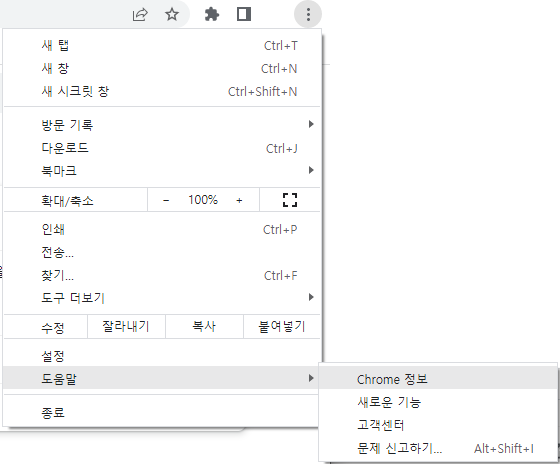
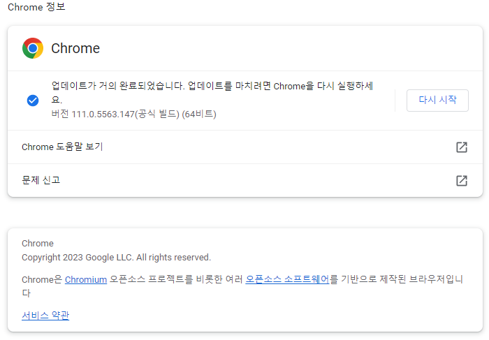
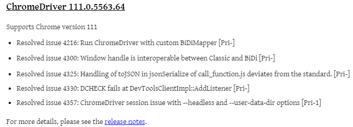
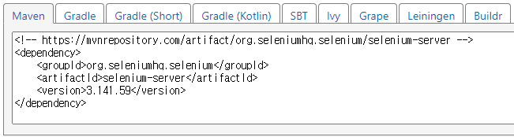
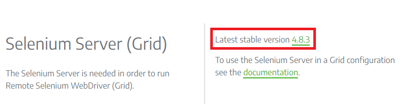

# Selenium + ChromeDriver

### 드라이버 + 라이브러리 다운로드
https://chromedriver.chromium.org/downloads   
https://www.selenium.dev/downloads/   
https://mvnrepository.com/artifact/org.seleniumhq.selenium/selenium-server   

chromedriver는 크롬과 통신 하기 위해 사용된다.   
selenium은 java 라이브러리로 직접 사이트 가서 받거나 maven으로 가져온다.