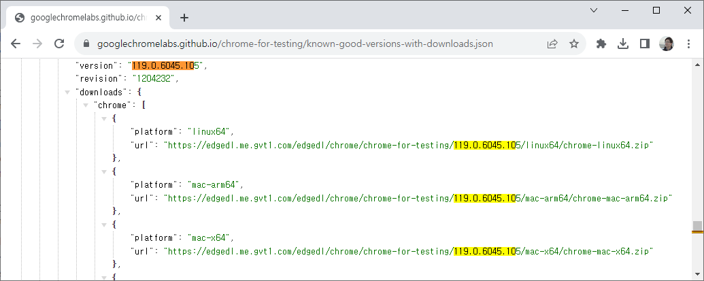

# Selenium + ChromeDriver
```
chrome://version
```


### 드라이버 + 라이브러리 다운로드
https://chromedriver.chromium.org/downloads   
https://github.com/GoogleChromeLabs/chrome-for-testing   
https://www.selenium.dev/downloads/   

크롬드라이버 신규버전은 깃허브(json-api-endpoints)에서 직접 확인 하자
https://googlechromelabs.github.io/chrome-for-testing/known-good-versions-with-downloads.json



chromedriver는 크롬과 통신 하기 위해 사용된다.   

---

# Selenium + WebDriverManager

크롬 업데이트 마다 chromedriver 찾지 말고, WebDriverManager 사용하자 
드라이버 의존성이 없다보니 다른 브라우저 사용도 쉽다.

```bash
Exception in thread "main" org.openqa.selenium.SessionNotCreatedException: Could not start a new session. Response code 500. Message: session not created: This version of ChromeDriver only supports Chrome version 119
Current browser version is 122.0.6261.95 with binary path C:\Program Files\Google\Chrome\Application\chrome.exe 
Host info: host: 'LAPTOP-G6QH942D', ip: '10.100.0.1'
Build info: version: '4.15.0', revision: '1d14b5521b'
System info: os.name: 'Windows 10', os.arch: 'amd64', os.version: '10.0', java.version: '17.0.2'
Driver info: org.openqa.selenium.chrome.ChromeDriver
Command: [null, newSession {capabilities=[Capabilities {browserName: chrome, goog:chromeOptions: {args: [], extensions: []}}]}]
    at org.openqa.selenium.remote.ProtocolHandshake.createSession(ProtocolHandshake.java:140)
    at org.openqa.selenium.remote.ProtocolHandshake.createSession(ProtocolHandshake.java:96)
    at org.openqa.selenium.remote.ProtocolHandshake.createSession(ProtocolHandshake.java:68)
    at org.openqa.selenium.remote.HttpCommandExecutor.execute(HttpCommandExecutor.java:163)
    at org.openqa.selenium.remote.service.DriverCommandExecutor.invokeExecute(DriverCommandExecutor.java:200)
    at org.openqa.selenium.remote.service.DriverCommandExecutor.execute(DriverCommandExecutor.java:175)
    at org.openqa.selenium.remote.RemoteWebDriver.execute(RemoteWebDriver.java:607)
    at org.openqa.selenium.remote.RemoteWebDriver.startSession(RemoteWebDriver.java:241)
    at org.openqa.selenium.remote.RemoteWebDriver.<init>(RemoteWebDriver.java:168)
    at org.openqa.selenium.chromium.ChromiumDriver.<init>(ChromiumDriver.java:108)
    at org.openqa.selenium.chrome.ChromeDriver.<init>(ChromeDriver.java:89)
    at org.openqa.selenium.chrome.ChromeDriver.<init>(ChromeDriver.java:84)
    at org.openqa.selenium.chrome.ChromeDriver.<init>(ChromeDriver.java:73)
    at com.toowis.Run.main(Run.java:22)
```

WebDriverManager   
https://bonigarcia.dev/webdrivermanager/

```xml
<dependency>
    <groupId>io.github.bonigarcia</groupId>
    <artifactId>webdrivermanager</artifactId>
    <version>5.7.0</version>
    <scope>test</scope>
</dependency>
```